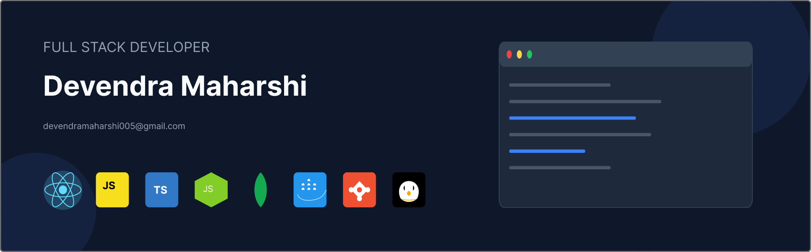

 
   

## About Me

I am a Full-Stack Developer with experience in React, Node.js, and Express, specializing in building scalable and high-performance applications. Passionate about writing clean, maintainable code, I have worked on frontend and backend development, RESTful APIs, authentication, and CI/CD pipelines. I enjoy solving complex problems and continuously learning new technologies to enhance user experience and application security.

## Connect with me

  
 

## Skills

